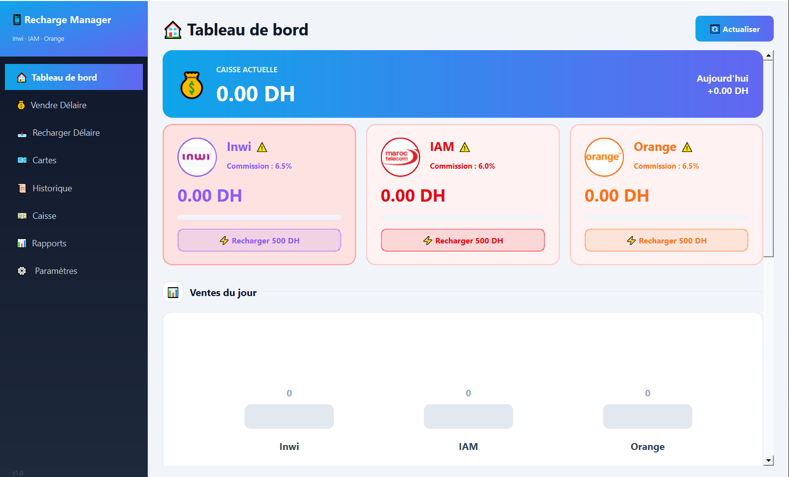
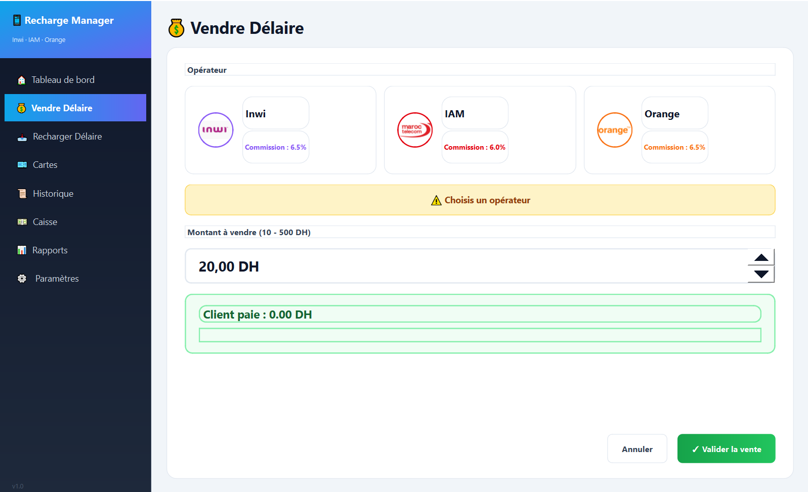
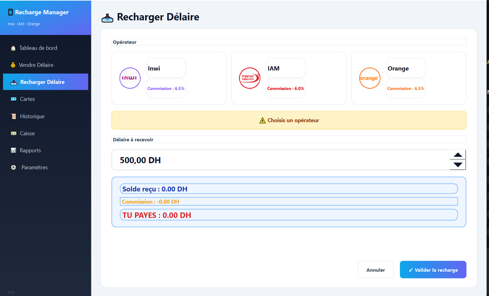
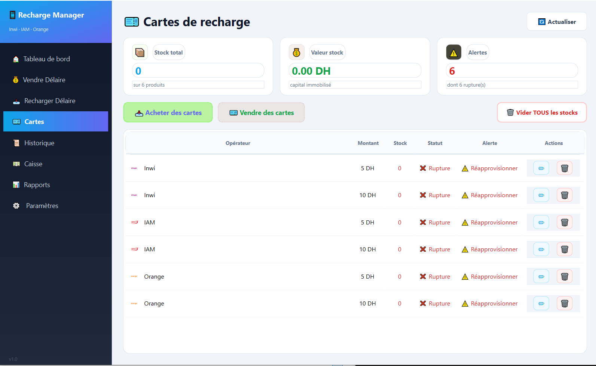
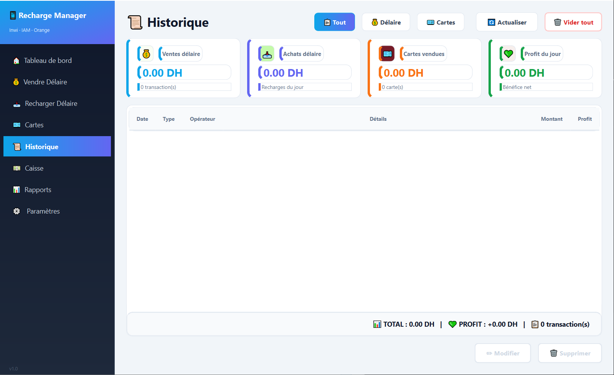
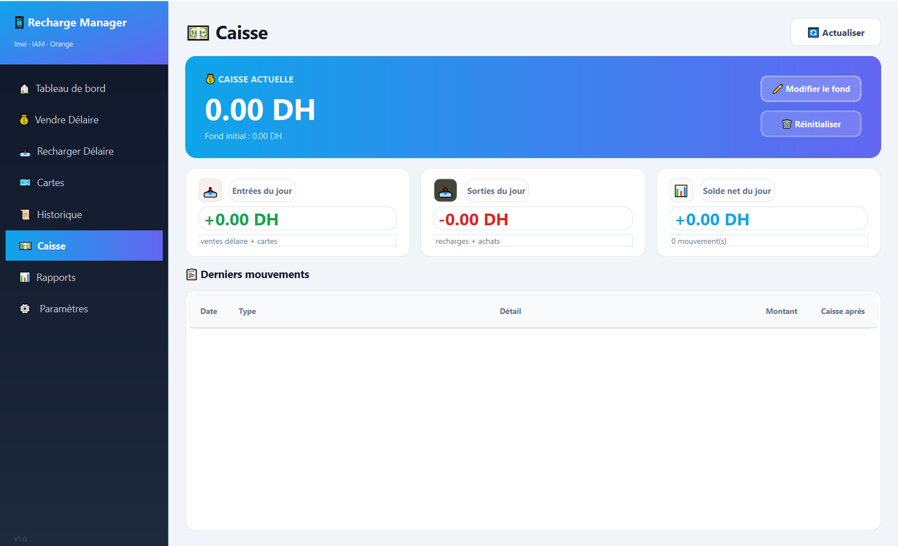
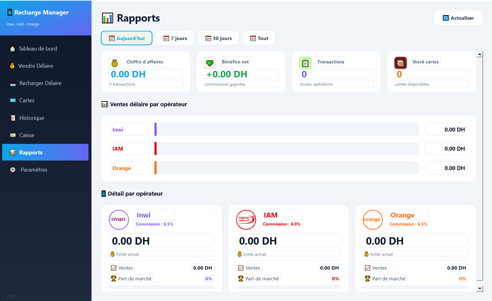
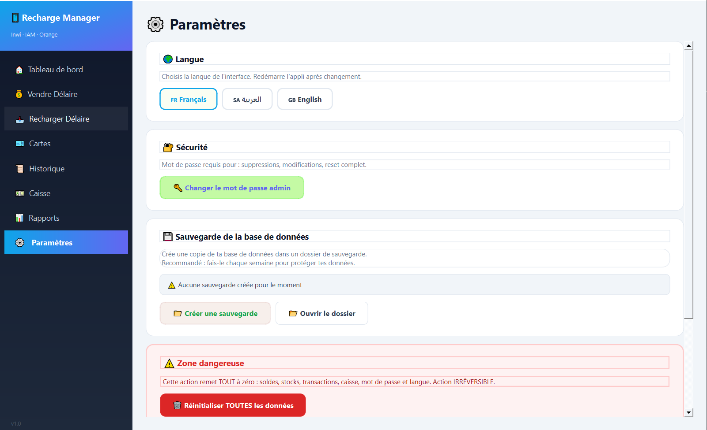

@@ -1,69 +0,0 @@
# 📱 Recharge Manager

Application de gestion de recharge délaire et cartes pour Inwi, IAM et Orange.

## ✨ Fonctionnalités

- 💰 **Vendre Délaire** : vends du crédit aux clients
- 📥 **Recharger Délaire** : recharge ton crédit
- 🎫 **Cartes** : gère ton stock de cartes
- 📜 **Historique** : consulte tes transactions
- 💵 **Caisse** : suivi automatique
- 📊 **Rapports** : statistiques
- ⚙️ **Paramètres** : langue, sécurité, backup

  ## 📸 Captures d'écran

### 🏠 Tableau de bord


*Vue d'ensemble : caisse, soldes opérateurs et graphique des ventes*

### 💰 Vendre Délaire


*Sélection de l'opérateur et validation de vente*

### 📥 Recharger Délaire


*Rechargement avec calcul automatique des commissions*

### 🎫 Gestion des Cartes


*Stock, alertes et mouvements de cartes prépayées*

### 📜 Historique


*Toutes les transactions avec filtres et totaux*

### 💵 Caisse


*Suivi automatique du fond de caisse*

### 📊 Rapports


*Statistiques par opérateur et période*

### ⚙️ Paramètres


*Configuration, sécurité et sauvegardes*

## 🛠️ Technologies

- Python 3.14
- PySide6 (Qt6)
- SQLite

## 🚀 Installation

```bash
git clone https://github.com/TON_USERNAME/recharge-manager.git
cd recharge-manager
pip install -r requirements.txt
python main.py
